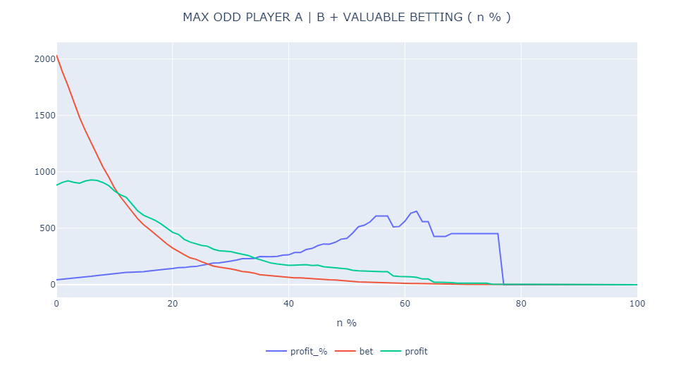
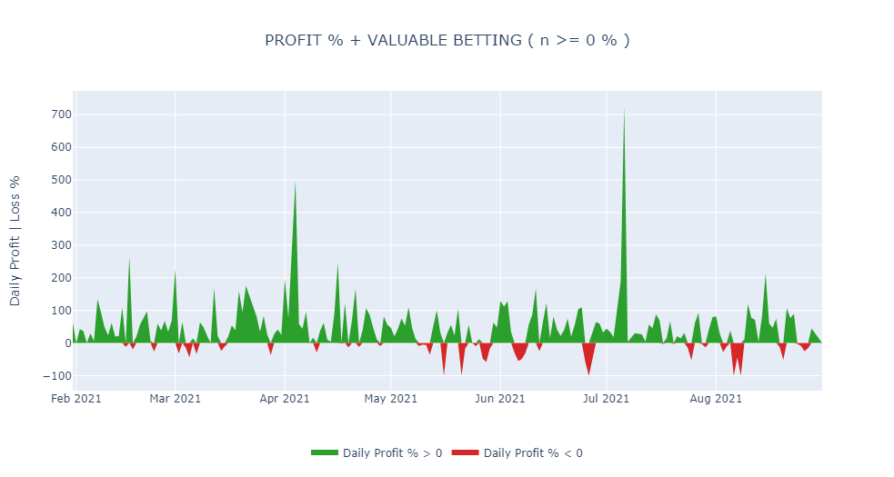

# Tennis Betting Bot

TBB is both a machine learning model ([Neural Network](https://en.wikipedia.org/wiki/Artificial_neural_network)) that outputs match-based win probabilities and an automated web scraping bot that scrapes ‘oddsportal.com’ future tennis matches in order to find the best bookmaker odd. 

The bot preprocesses both outputs and if the bet is considered valuable by over _n_ % (hyperparameter), an automated email is sent with informations regarding the tournament, players, predicted_odd and the maximal bookmaker_odd.

### Neural Network
The model is trained on historical data as to optimize on prediction rates and to determine optimal feature weights.
In order to further increase prediction accuracy, the Neural Network is trained specifically for the 3 main different surfaces, resulting in different feature weights per surface (clay, hard and grass courts).

Multiple features were considered for every player and match, such as: ATP Points, H2H Wins, Recent Form by Surface, Tournament and Tournament Round, etc. In particular, the [Elo Ratings](https://en.wikipedia.org/wiki/Elo_rating_system) is one of the main contributors to the match prediction probability.

### OddsPortal
[Oddsportal.com](https://www.oddsportal.com/) is a website containing both historical and future betting odds concerning a wide range of sports and bookmakers, including tennis. In order to leverage the highest possible match odd, [Selenium](https://www.selenium.dev/) is used to scrape every future tennis matches while a preprocessing function filters for the best available bookmaker. For further information on how to use Selenium with Python for browser automation projects, please refer to the following [documentation](https://www.selenium.dev/documentation/).

## Betting Strategy Analysis
While most of the implementation is confidential, a financial simulation on over 2.000 matches from 2021 showcased a positive ROI. 6 betting strategies were tested, including: always betting on the favourite player, always betting on the underdog and a mix of the previous with valuable betting. 

Value Bets are bets placed at odds that are higher than the predicted actual probability. The idea comes from the mathematical concept of Expected Value and is a long term betting strategy.

By simulating multiple scenarios where we set a given _n_ % (_n_: how percentually higher is the bookmaker vs. the predicted probability), a _n_ ~ 7 % maximizes absolute profit.

Next steps consist in further financial analysis in production from October 2021 until the end of the current season and, if successful, an automated betting in 2022.

## AWS Production Environment
### EC2 Deployment
TBB is currently in production using a AWS Account with a EC2 Virtual Server in the Cloud. Fully managed by the repository owner, using EC2 tree tier t2.micro, 1GB RAM, 30GB EBS with Windows 10 and Task Scheduler running .bat file at a scheduled datetime (currently 2h interval).

### T2 Instance & CPU Credit Management
The t2 operates as a Burstable Performance Instances providing a baseline CPU performance under normal workload. But when the workload increases Burstable Performance Instances have the ability to burst, i.e. increase the CPU performance. CPU Credit regulates the amount CPU burst of an instance. You can spend this CPU Credit to increase the CPU performance during the Burst period. Suppose you are operating the instance at 100% of CPU performance for 5 minutes, you will spend 5 (i.e. 5\*1.0) CPU Credit. Similarly if you run an instance at 50% CPU performance for 5 minutes you will spend 2.5 (i.e. 5\*0.5) CPU Credits. CPU Credit Balance is simply the amount of CPU Credit available in your account at any moment. 

Since the t2.micro elavates the CPU Utilization up to 50-75% while running the script, a CPU Credit management system was developed in order to avoid null CPU Credit available at the scheduled time. The solution orchestrates two lambda functions: ec2-stop-instance and ec2-start-instance and the same two CloudWatch Rules. The above functions are set to trigger according to the following cron expressions: 30 */12 * * ? * (stop) and 35 */12 * * ? * (start) (5 minutes after stopping the instance).

## Contributing
TBB is currently a closed source invitation only project.

## License
[MIT](https://choosealicense.com/licenses/apache-2.0/)