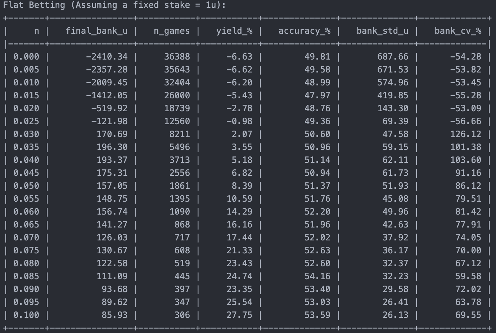
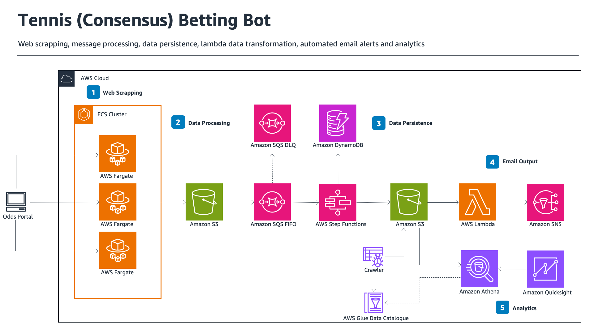

# Test DF

Flat Betting (Assuming a fixed stake = 1u):

|     n | final_bank_u | n_games | yield_% | accuracy_% | bank_std_u | bank_cv_% |
| ----: | -----------: | ------: | ------: | ---------: | ---------: | --------: |
| 0.000 |     -2410.34 |   36388 |   -6.63 |      49.81 |     687.66 |    -54.28 |
| 0.005 |     -2357.28 |   35643 |   -6.62 |      49.58 |     671.53 |    -53.82 |
| 0.010 |     -2009.45 |   32404 |   -6.20 |      48.99 |     574.96 |    -53.45 |
| 0.015 |     -1412.05 |   26000 |   -5.43 |      47.97 |     419.85 |    -55.28 |
| 0.020 |      -519.92 |   18739 |   -2.78 |      48.76 |     143.30 |    -53.09 |
| 0.025 |      -121.98 |   12560 |   -0.98 |      49.36 |      69.39 |    -56.66 |
| 0.030 |       170.69 |    8211 |    2.07 |      50.60 |      47.58 |    126.12 |
| 0.035 |       196.30 |    5496 |    3.55 |      50.96 |      59.15 |    101.38 |
| 0.040 |       193.37 |    3713 |    5.18 |      51.14 |      62.11 |    103.60 |
| 0.045 |       175.31 |    2556 |    6.82 |      50.94 |      61.73 |     91.16 |
| 0.050 |       157.05 |    1861 |    8.39 |      51.37 |      51.93 |     86.12 |
| 0.055 |       148.75 |    1395 |   10.59 |      51.76 |      45.08 |     79.51 |
| 0.060 |       156.74 |    1090 |   14.29 |      52.20 |      49.96 |     81.42 |
| 0.065 |       141.27 |     868 |   16.16 |      51.96 |      42.63 |     77.91 |
| 0.070 |       126.03 |     717 |   17.44 |      52.02 |      37.92 |     74.05 |
| 0.075 |       130.67 |     608 |   21.33 |      52.63 |      36.17 |     70.00 |
| 0.080 |       122.58 |     519 |   23.43 |      52.60 |      32.37 |     67.12 |
| 0.085 |       111.09 |     445 |   24.74 |      54.16 |      32.23 |     59.58 |
| 0.090 |        93.68 |     397 |   23.35 |      53.40 |      29.58 |     72.02 |
| 0.095 |        89.62 |     347 |   25.54 |      53.03 |      26.41 |     63.78 |
| 0.100 |        85.93 |     306 |   27.75 |      53.59 |      26.13 |     69.55 |

## License
[MIT](https://choosealicense.com/licenses/apache-2.0/)