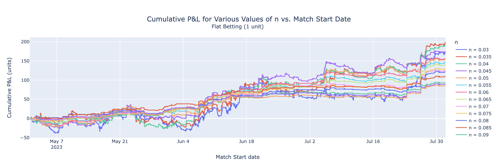
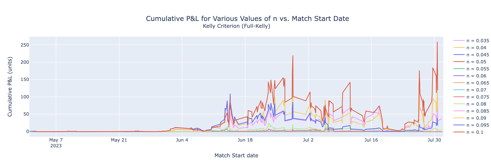
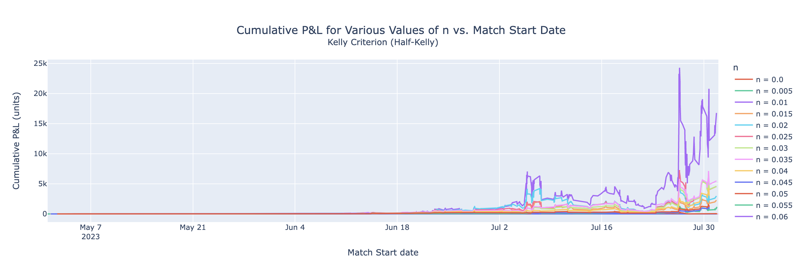
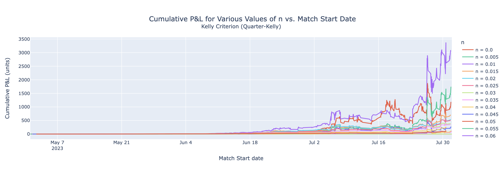
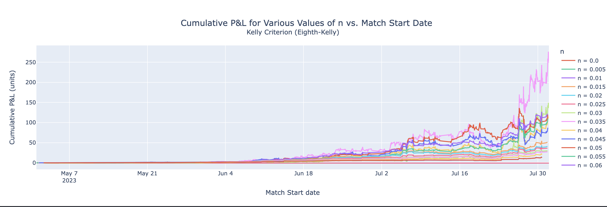
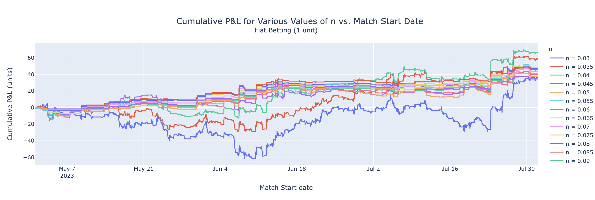
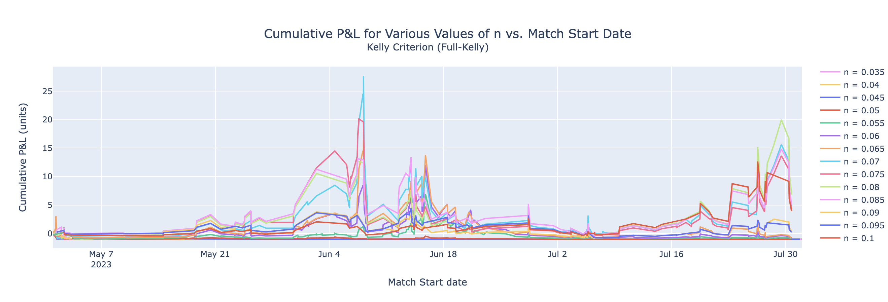
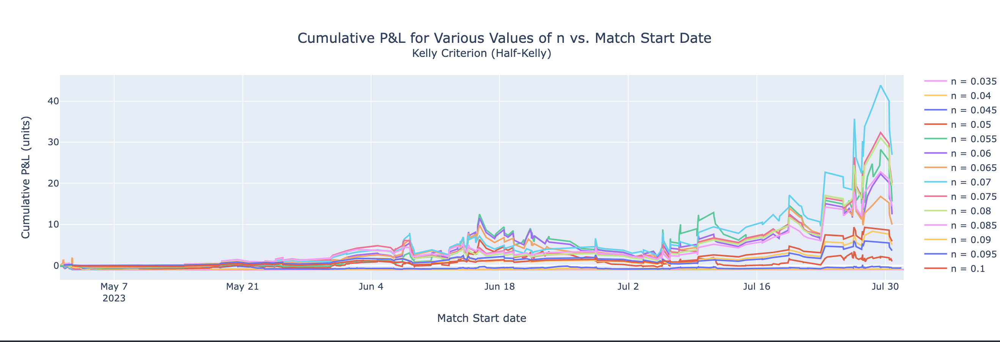
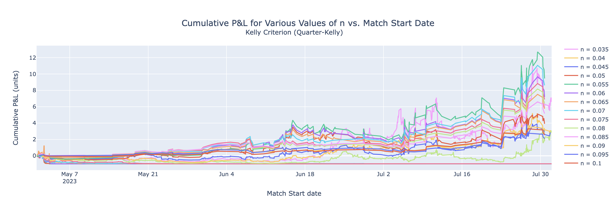
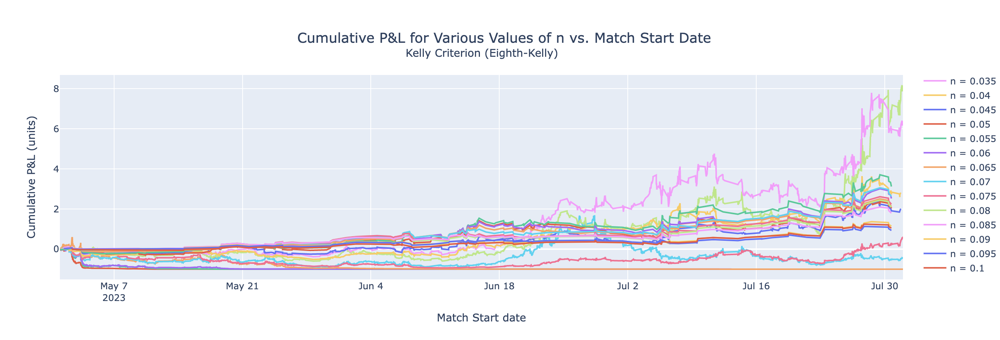

# Tennis (Consensus) Betting Bot
## Table of contents
1. [Introduction](#introduction)
   1. [An Illustrative Case - Halle ATP 500](#introduction1)
   2. [Learning (Quickly) from the Past](#introduction2)
   3. [A Fusion of Strategies](#introduction3)
2. [Literature Review](#paragraph1)
3. [Methodology](#paragraph1)
    1. [Sub paragraph](#subparagraph1)
4. [Results](#results)
   1. [Unconstrained](#unconstrained)
      1. [Flat Betting](#unconstrained_fb)
      2. [Full-Kelly](#paragraph2)
      3. [Half-Kelly](#paragraph2)
      4. [Quarter-Kelly](#paragraph2)
      5. [Eight-Kelly](#paragraph2)
   2. [Constrained](#constrained)
      1. [Flat Betting](#paragraph2)
      2. [Full-Kelly](#paragraph2)
      3. [Half-Kelly](#paragraph2)
      4. [Quarter-Kelly](#paragraph2)
      5. [Eight-Kelly](#paragraph2)
5. [Discussion](#discussion)

## Introduction 
One year since the debut of the Tennis Betting Bot (TBB), a new approach has emerged, rooted in bookmakers' consensus, signifying a noteworthy advancement.
#### An Illustrative Case - Halle ATP 500 
In a recent Halle ATP 500 match between Richard Gasquet and Jannik Sinner, bookmakers favored Gasquet with average decimal odds of approximately 5.00, peaking at 5.39 on Pinnacle. Conversely, TBB projected a 41.15% chance of a Gasquet victory, equivalent to decimal odds of 2.43. Despite Gasquet's eventual loss, this marked a notable 116% difference, prompting a pertinent question: Could TBB's projections surpass those of 25 specialized bookmakers on the long term?

#### Learning (Quickly) from the Past 
Reflecting on the prior TBB version driven by machine learning (ML), the 2023 grass season exposed its impracticality. Swiftly changing inputs hindered an effective ML pipeline. The fast changes in information weren't caught quickly enough, making it hard to create a good feedback loop for adjusting the ML system's settings. This resulted in a devastating -660% return on investment (ROI).

#### A Fusion of Strategies 
Inspired by "Beating the Bookies with their own Numbers" by Kaunitz, Shenjun, and Kreiner, the new Tennis (Consensus) Betting Bot (TCBB) embraces a symbiotic approach. It capitalizes on publicly available odds from various bookmakers to find bets with mispriced odds and positive expected value.

Ahead, we delve into the mechanics of the Tennis (Consensus) Betting Bot, tracing its evolution, strategies, and efficacy across the bookmaker landscape. 

## Results 

### Uncontrained Simulations 

Flat Betting (Assuming a fixed stake = 1u)

|     n | final_bank_u | n_games | yield_% | accuracy_% | bank_std_u | bank_cv_% |
| ----: | -----------: | ------: | ------: | ---------: | ---------: | --------: |
| 0.000 |     -2410.34 |   36388 |   -6.63 |      49.81 |     687.66 |    -54.28 |
| 0.005 |     -2357.28 |   35643 |   -6.62 |      49.58 |     671.53 |    -53.82 |
| 0.010 |     -2009.45 |   32404 |   -6.20 |      48.99 |     574.96 |    -53.45 |
| 0.015 |     -1412.05 |   26000 |   -5.43 |      47.97 |     419.85 |    -55.28 |
| 0.020 |      -519.92 |   18739 |   -2.78 |      48.76 |     143.30 |    -53.09 |
| 0.025 |      -121.98 |   12560 |   -0.98 |      49.36 |      69.39 |    -56.66 |
| 0.030 |       170.69 |    8211 |    2.07 |      50.60 |      47.58 |    126.12 |
| 0.035 |       196.30 |    5496 |    3.55 |      50.96 |      59.15 |    101.38 |
| 0.040 |       193.37 |    3713 |    5.18 |      51.14 |      62.11 |    103.60 |
| 0.045 |       175.31 |    2556 |    6.82 |      50.94 |      61.73 |     91.16 |
| 0.050 |       157.05 |    1861 |    8.39 |      51.37 |      51.93 |     86.12 |
| 0.055 |       148.75 |    1395 |   10.59 |      51.76 |      45.08 |     79.51 |
| 0.060 |       156.74 |    1090 |   14.29 |      52.20 |      49.96 |     81.42 |
| 0.065 |       141.27 |     868 |   16.16 |      51.96 |      42.63 |     77.91 |
| 0.070 |       126.03 |     717 |   17.44 |      52.02 |      37.92 |     74.05 |
| 0.075 |       130.67 |     608 |   21.33 |      52.63 |      36.17 |     70.00 |
| 0.080 |       122.58 |     519 |   23.43 |      52.60 |      32.37 |     67.12 |
| 0.085 |       111.09 |     445 |   24.74 |      54.16 |      32.23 |     59.58 |
| 0.090 |        93.68 |     397 |   23.35 |      53.40 |      29.58 |     72.02 |
| 0.095 |        89.62 |     347 |   25.54 |      53.03 |      26.41 |     63.78 |
| 0.100 |        85.93 |     306 |   27.75 |      53.59 |      26.13 |     69.55 |

Full-Kelly (Assuming a starting bank = 1u)

|     n | final_bank_u | n_games | accuracy_% | yield_% | bank_std_u | bank_cv_% |
| ----: | -----------: | ------: | ---------: | ------: | ---------: | --------: |
| 0.000 |         0.00 |   36388 |      49.81 |   -8.06 |       0.02 |   2358.22 |
| 0.005 |         0.00 |   35643 |      49.58 |   -7.57 |       0.02 |   2261.99 |
| 0.010 |         0.00 |   32404 |      48.99 |   -7.58 |       0.03 |   2130.76 |
| 0.015 |         0.00 |   26000 |      47.97 |   -6.76 |       0.04 |   2009.03 |
| 0.020 |         0.00 |   18739 |      48.76 |   -9.49 |       0.03 |   1590.77 |
| 0.025 |         0.00 |   12560 |      49.36 |   -5.93 |       0.05 |   1302.50 |
| 0.030 |         0.00 |    8211 |      50.60 |   -7.29 |       0.08 |   1474.63 |
| 0.035 |         0.00 |    5496 |      50.96 |   -7.18 |       0.09 |   1060.10 |
| 0.040 |         0.00 |    3713 |      51.14 |  -15.60 |       0.06 |   1085.84 |
| 0.045 |         0.00 |    2556 |      50.94 |   -7.29 |       0.13 |    749.25 |
| 0.050 |         0.00 |    1861 |      51.37 |  -19.22 |       0.07 |    745.38 |
| 0.055 |         0.00 |    1395 |      51.76 |  -28.39 |       0.05 |    716.29 |
| 0.060 |         0.00 |    1090 |      52.20 |  -23.93 |       0.07 |    577.55 |
| 0.065 |         0.00 |     868 |      51.96 |  -16.67 |       0.09 |    388.46 |
| 0.070 |         0.01 |     717 |      52.02 |   -0.84 |       1.24 |    210.02 |
| 0.075 |         0.35 |     608 |      52.63 |   -0.23 |       2.27 |    141.19 |
| 0.080 |         5.22 |     519 |      52.60 |    0.73 |       4.88 |    120.22 |
| 0.085 |        38.59 |     445 |      54.16 |    1.45 |      23.63 |    115.17 |
| 0.090 |        58.65 |     397 |      53.40 |    2.06 |      28.58 |    113.14 |
| 0.095 |        17.92 |     347 |      53.03 |    1.08 |      20.94 |    128.75 |
| 0.100 |       119.90 |     306 |      53.59 |    3.45 |      47.84 |    117.57 |

Half-Kelly (Assuming a starting bank = 1u)

|     n | final_bank_u | n_games | accuracy_% | yield_% | bank_std_u | bank_cv_% |
| ----: | -----------: | ------: | ---------: | ------: | ---------: | --------: |
| 0.000 |         0.00 |   36388 |      49.81 |   -4.55 |       0.05 |   1402.44 |
| 0.005 |         0.00 |   35643 |      49.58 |   -4.38 |       0.05 |   1364.17 |
| 0.010 |         0.00 |   32404 |      48.99 |   -4.44 |       0.05 |   1280.98 |
| 0.015 |         0.00 |   26000 |      47.97 |   -3.40 |       0.07 |    936.15 |
| 0.020 |         0.00 |   18739 |      48.76 |   -4.09 |       0.07 |    890.28 |
| 0.025 |         0.00 |   12560 |      49.36 |   -4.87 |       0.10 |    944.19 |
| 0.030 |         0.00 |    8211 |      50.60 |   -7.66 |       0.09 |    899.72 |
| 0.035 |         0.00 |    5496 |      50.96 |   -7.62 |       0.12 |    750.03 |
| 0.040 |         0.00 |    3713 |      51.14 |  -14.37 |       0.08 |    719.85 |
| 0.045 |         0.08 |    2556 |      50.94 |   -0.81 |       0.37 |    123.68 |
| 0.050 |        49.74 |    1861 |      51.37 |    0.59 |      60.32 |    198.68 |
| 0.055 |      1175.07 |    1395 |      51.76 |    7.03 |     194.45 |    233.05 |
| 0.060 |     16768.13 |    1090 |      52.20 |    5.43 |    3929.18 |    199.77 |
| 0.065 |      2276.34 |     868 |      51.96 |    4.45 |     586.57 |    145.67 |
| 0.070 |      2969.12 |     717 |      52.02 |    3.53 |    1154.32 |    141.41 |
| 0.075 |      4562.71 |     608 |      52.63 |    7.49 |    1201.06 |    169.57 |
| 0.080 |      4578.19 |     519 |      52.60 |   10.76 |    1058.85 |    176.26 |
| 0.085 |      5486.35 |     445 |      54.16 |   12.03 |    1223.85 |    168.85 |
| 0.090 |      3007.96 |     397 |      53.40 |   13.37 |     660.72 |    164.99 |
| 0.095 |       846.36 |     347 |      53.03 |   12.61 |     181.12 |    132.29 |
| 0.100 |      1133.21 |     306 |      53.59 |   15.02 |     262.67 |    146.41 |

Quarter-Kelly (Assuming a starting bank = 1u)

|     n | final_bank_u | n_games | accuracy_% | yield_% | bank_std_u | bank_cv_% |
| ----: | -----------: | ------: | ---------: | ------: | ---------: | --------: |
| 0.000 |         0.00 |   36388 |      49.81 |   -3.59 |       0.07 |    878.63 |
| 0.005 |         0.00 |   35643 |      49.58 |   -3.48 |       0.08 |    843.47 |
| 0.010 |         0.00 |   32404 |      48.99 |   -3.26 |       0.08 |    738.96 |
| 0.015 |         0.00 |   26000 |      47.97 |   -2.43 |       0.12 |    620.12 |
| 0.020 |         0.00 |   18739 |      48.76 |   -3.12 |       0.12 |    550.93 |
| 0.025 |         0.00 |   12560 |      49.36 |   -4.89 |       0.12 |    574.61 |
| 0.030 |         1.31 |    8211 |      50.60 |    0.28 |       0.26 |    147.23 |
| 0.035 |        83.69 |    5496 |      50.96 |    1.86 |      15.10 |    144.43 |
| 0.040 |       123.44 |    3713 |      51.14 |    3.00 |      20.23 |    140.77 |
| 0.045 |       277.42 |    2556 |      50.94 |    2.29 |      92.83 |    145.23 |
| 0.050 |      1188.58 |    1861 |      51.37 |    3.96 |     359.75 |    164.45 |
| 0.055 |      1746.77 |    1395 |      51.76 |   10.93 |     308.81 |    197.53 |
| 0.060 |      3096.49 |    1090 |      52.20 |    9.94 |     677.73 |    174.32 |
| 0.065 |       711.24 |     868 |      51.96 |    9.38 |     160.20 |    136.47 |
| 0.070 |       548.44 |     717 |      52.02 |    8.72 |     148.91 |    125.00 |
| 0.075 |       503.76 |     608 |      52.63 |   12.88 |     120.59 |    136.40 |
| 0.080 |       386.59 |     519 |      52.60 |   15.71 |      91.10 |    135.32 |
| 0.085 |       353.02 |     445 |      54.16 |   16.86 |      82.64 |    127.73 |
| 0.090 |       220.67 |     397 |      53.40 |   18.11 |      51.27 |    120.44 |
| 0.095 |       101.54 |     347 |      53.03 |   17.63 |      23.10 |     99.86 |
| 0.100 |       102.67 |     306 |      53.59 |   20.31 |      24.92 |    105.38 |

Eighth-Kelly (Assuming a starting bank = 1u)

|     n | final_bank_u | n_games | accuracy_% | yield_% | bank_std_u | bank_cv_% |
| ----: | -----------: | ------: | ---------: | ------: | ---------: | --------: |
| 0.000 |         0.00 |   36388 |      49.81 |   -2.87 |       0.11 |    500.56 |
| 0.005 |         0.00 |   35643 |      49.58 |   -2.80 |       0.11 |    483.83 |
| 0.010 |         0.00 |   32404 |      48.99 |   -2.35 |       0.12 |    396.78 |
| 0.015 |         0.00 |   26000 |      47.97 |   -1.77 |       0.17 |    307.29 |
| 0.020 |         0.00 |   18739 |      48.76 |   -1.64 |       0.17 |    209.96 |
| 0.025 |         0.16 |   12560 |      49.36 |   -1.51 |       0.16 |    143.53 |
| 0.030 |       137.80 |    8211 |      50.60 |    3.63 |      24.89 |    212.05 |
| 0.035 |       249.42 |    5496 |      50.96 |    3.62 |      47.75 |    148.58 |
| 0.040 |       116.15 |    3713 |      51.14 |    4.68 |      22.14 |    128.43 |
| 0.045 |        88.09 |    2556 |      50.94 |    4.40 |      24.54 |    118.96 |
| 0.050 |       120.63 |    1861 |      51.37 |    6.51 |      34.24 |    130.02 |
| 0.055 |       110.66 |    1395 |      51.76 |   11.81 |      23.89 |    133.85 |
| 0.060 |       122.96 |    1090 |      52.20 |   12.18 |      30.71 |    124.26 |
| 0.065 |        52.51 |     868 |      51.96 |   11.82 |      13.52 |    101.48 |
| 0.070 |        41.96 |     717 |      52.02 |   12.03 |      11.98 |     94.16 |
| 0.075 |        37.40 |     608 |      52.63 |   15.46 |       9.69 |     92.67 |
| 0.080 |        30.74 |     519 |      52.60 |   17.98 |       7.89 |     89.31 |
| 0.085 |        28.08 |     445 |      54.16 |   19.20 |       7.15 |     83.61 |
| 0.090 |        21.30 |     397 |      53.40 |   20.38 |       5.34 |     77.76 |
| 0.095 |        13.95 |     347 |      53.03 |   19.94 |       3.34 |     64.54 |
| 0.100 |        13.57 |     306 |      53.59 |   22.93 |       3.40 |     67.13 |

### Constrained Simulations 

Flat Betting (Assuming a fixed stake = 1u)

|     n | final_bank_u | n_games | yield_% | accuracy_% | bank_std_u | bank_cv_% |
| ----: | -----------: | ------: | ------: | ---------: | ---------: | --------: |
| 0.000 |     -2899.88 |   32034 |   -9.06 |      49.55 |     832.90 |    -55.18 |
| 0.005 |     -2393.36 |   27351 |   -8.75 |      49.03 |     691.79 |    -55.47 |
| 0.010 |     -1617.53 |   20506 |   -7.89 |      48.12 |     456.79 |    -53.57 |
| 0.015 |      -713.40 |   13448 |   -5.31 |      48.36 |     204.93 |    -48.12 |
| 0.020 |      -293.05 |    7985 |   -3.68 |      49.69 |      76.58 |    -44.31 |
| 0.025 |      -106.65 |    4515 |   -2.38 |      50.68 |      48.05 |    -46.54 |
| 0.030 |        38.59 |    2565 |    1.47 |      52.24 |      19.84 |   -128.87 |
| 0.035 |        60.50 |    1548 |    3.84 |      52.45 |      23.96 |    431.10 |
| 0.040 |        67.68 |     961 |    6.94 |      51.72 |      22.40 |    126.29 |
| 0.045 |        48.04 |     631 |    7.45 |      50.08 |      12.54 |     87.76 |
| 0.050 |        42.01 |     449 |    9.13 |      48.78 |      12.16 |     94.36 |
| 0.055 |        48.68 |     340 |   14.02 |      49.12 |      14.34 |     83.93 |
| 0.060 |        40.62 |     278 |   14.25 |      48.20 |      11.93 |     85.22 |
| 0.065 |        49.00 |     232 |   20.69 |      48.71 |      14.07 |     79.65 |
| 0.070 |        44.92 |     198 |   22.18 |      50.00 |      13.29 |     70.38 |
| 0.075 |        47.69 |     178 |   26.23 |      50.00 |      13.37 |     64.77 |
| 0.080 |        48.04 |     155 |   30.35 |      50.97 |      13.89 |     64.44 |
| 0.085 |        46.86 |     144 |   31.85 |      50.69 |      13.84 |     60.66 |
| 0.090 |        35.43 |     128 |   26.90 |      47.66 |      11.44 |     76.43 |
| 0.095 |        35.62 |     114 |   30.37 |      47.37 |      11.84 |     72.42 |
| 0.100 |        38.80 |      99 |   38.18 |      48.48 |      12.89 |     83.26 |

Full-Kelly (Assuming a starting bank = 1u)

|     n | final_bank_u | n_games | accuracy_% | yield_% | bank_std_u | bank_cv_% |
| ----: | -----------: | ------: | ---------: | ------: | ---------: | --------: |
| 0.000 |         0.00 |   32034 |      49.55 |   -8.69 |       0.02 |   2294.34 |
| 0.005 |         0.00 |   27351 |      49.03 |   -4.68 |       0.04 |   1961.00 |
| 0.010 |         0.00 |   20506 |      48.12 |   -5.68 |       0.05 |   1836.61 |
| 0.015 |         0.00 |   13448 |      48.36 |   -2.59 |       0.12 |   1374.20 |
| 0.020 |         0.00 |    7985 |      49.69 |  -10.92 |       0.04 |   1659.85 |
| 0.025 |         0.00 |    4515 |      50.68 |  -12.73 |       0.05 |   1237.01 |
| 0.030 |         0.00 |    2565 |      52.24 |  -12.75 |       0.07 |    881.07 |
| 0.035 |         0.00 |    1548 |      52.45 |  -11.83 |       0.12 |    815.67 |
| 0.040 |         0.00 |     961 |      51.72 |  -31.30 |       0.06 |    786.41 |
| 0.045 |         0.00 |     631 |      50.08 |  -19.70 |       0.12 |    503.08 |
| 0.050 |         0.00 |     449 |      48.78 |   -8.79 |       0.15 |    198.23 |
| 0.055 |         0.08 |     340 |      49.12 |   -1.11 |       0.97 |    130.82 |
| 0.060 |         0.18 |     278 |      48.20 |   -0.52 |       2.21 |    122.25 |
| 0.065 |         0.27 |     232 |      48.71 |   -0.43 |       3.09 |    128.52 |
| 0.070 |         5.82 |     198 |      50.00 |    1.88 |       4.75 |    105.61 |
| 0.075 |         5.29 |     178 |      50.00 |    2.43 |       3.89 |    103.87 |
| 0.080 |         7.82 |     155 |      50.97 |    4.34 |       3.87 |    100.24 |
| 0.085 |         6.08 |     144 |      50.69 |    3.19 |       3.65 |     85.19 |
| 0.090 |         1.39 |     128 |      47.66 |    0.78 |       1.07 |     71.71 |
| 0.095 |         1.17 |     114 |      47.37 |    0.32 |       1.15 |     63.16 |
| 0.100 |         4.92 |      99 |      48.48 |    6.10 |       2.90 |    105.55 |

Half-Kelly (Assuming a starting bank = 1u)

|     n | final_bank_u | n_games | accuracy_% | yield_% | bank_std_u | bank_cv_% |
| ----: | -----------: | ------: | ---------: | ------: | ---------: | --------: |
| 0.000 |         0.00 |   32034 |      49.55 |   -4.42 |       0.05 |   1224.71 |
| 0.005 |         0.00 |   27351 |      49.03 |   -2.94 |       0.07 |   1049.01 |
| 0.010 |         0.00 |   20506 |      48.12 |   -4.18 |       0.07 |   1046.90 |
| 0.015 |         0.00 |   13448 |      48.36 |   -1.84 |       0.19 |    772.40 |
| 0.020 |         0.00 |    7985 |      49.69 |   -8.65 |       0.07 |    854.82 |
| 0.025 |         0.00 |    4515 |      50.68 |   -9.28 |       0.08 |    654.66 |
| 0.030 |         0.00 |    2565 |      52.24 |   -6.87 |       0.13 |    414.17 |
| 0.035 |         0.02 |    1548 |      52.45 |   -4.83 |       0.15 |    191.84 |
| 0.040 |         0.09 |     961 |      51.72 |   -4.59 |       0.12 |     91.01 |
| 0.045 |         0.45 |     631 |      50.08 |   -1.48 |       0.20 |     52.52 |
| 0.050 |         1.99 |     449 |      48.78 |    0.79 |       1.27 |     67.71 |
| 0.055 |        16.57 |     340 |      49.12 |    4.99 |       6.06 |     92.47 |
| 0.060 |        13.42 |     278 |      48.20 |    5.11 |       4.88 |     78.03 |
| 0.065 |        10.94 |     232 |      48.71 |    5.40 |       4.50 |     77.50 |
| 0.070 |        27.90 |     198 |      50.00 |   13.17 |       8.38 |    106.63 |
| 0.075 |        21.01 |     178 |      50.00 |   14.20 |       6.40 |    103.03 |
| 0.080 |        20.48 |     155 |      50.97 |   16.73 |       6.30 |    109.42 |
| 0.085 |        15.38 |     144 |      50.69 |   14.80 |       4.66 |     88.96 |
| 0.090 |         6.09 |     128 |      47.66 |   11.82 |       1.83 |     68.85 |
| 0.095 |         4.62 |     114 |      47.37 |    9.73 |       1.37 |     52.63 |
| 0.100 |         6.89 |      99 |      48.48 |   16.98 |       2.48 |     83.24 |

Quarter-Kelly (Assuming a starting bank = 1u)

|     n | final_bank_u | n_games | accuracy_% | yield_% | bank_std_u | bank_cv_% |
| ----: | -----------: | ------: | ---------: | ------: | ---------: | --------: |
| 0.000 |         0.00 |   32034 |      49.55 |   -3.52 |       0.08 |    831.63 |
| 0.005 |         0.00 |   27351 |      49.03 |   -2.44 |       0.11 |    670.30 |
| 0.010 |         0.00 |   20506 |      48.12 |   -3.44 |       0.10 |    631.85 |
| 0.015 |         0.00 |   13448 |      48.36 |   -1.94 |       0.20 |    432.59 |
| 0.020 |         0.00 |    7985 |      49.69 |   -4.01 |       0.11 |    279.02 |
| 0.025 |         0.02 |    4515 |      50.68 |   -4.84 |       0.14 |    258.42 |
| 0.030 |         4.07 |    2565 |      52.24 |    2.44 |       0.59 |     96.87 |
| 0.035 |         8.08 |    1548 |      52.45 |    2.36 |       2.45 |    100.38 |
| 0.040 |         4.12 |     961 |      51.72 |    2.53 |       1.43 |     86.68 |
| 0.045 |         3.85 |     631 |      50.08 |    3.76 |       1.03 |     64.56 |
| 0.050 |         4.91 |     449 |      48.78 |    4.60 |       1.51 |     57.95 |
| 0.055 |        10.45 |     340 |      49.12 |    9.83 |       3.01 |     74.23 |
| 0.060 |         8.19 |     278 |      48.20 |   10.20 |       2.24 |     61.30 |
| 0.065 |         6.75 |     232 |      48.71 |   10.97 |       1.92 |     57.98 |
| 0.070 |         9.61 |     198 |      50.00 |   18.10 |       2.38 |     66.24 |
| 0.075 |         7.89 |     178 |      50.00 |   19.06 |       1.93 |     61.97 |
| 0.080 |         7.39 |     155 |      50.97 |   21.67 |       1.81 |     63.21 |
| 0.085 |         6.16 |     144 |      50.69 |   20.21 |       1.47 |     53.79 |
| 0.090 |         3.70 |     128 |      47.66 |   17.24 |       0.82 |     42.49 |
| 0.095 |         3.08 |     114 |      47.37 |   15.56 |       0.65 |     34.30 |
| 0.100 |         3.55 |      99 |      48.48 |   22.64 |       0.90 |     47.09 |

Eighth-Kelly (Assuming a starting bank = 1u)

|     n | final_bank_u | n_games | accuracy_% | yield_% | bank_std_u | bank_cv_% |
| ----: | -----------: | ------: | ---------: | ------: | ---------: | --------: |
| 0.000 |         0.00 |   32034 |      49.55 |   -3.35 |       0.11 |    538.40 |
| 0.005 |         0.00 |   27351 |      49.03 |   -2.23 |       0.15 |    399.78 |
| 0.010 |         0.00 |   20506 |      48.12 |   -2.69 |       0.14 |    331.98 |
| 0.015 |         0.00 |   13448 |      48.36 |   -1.33 |       0.26 |    185.44 |
| 0.020 |         0.55 |    7985 |      49.69 |   -0.25 |       0.43 |     74.40 |
| 0.025 |         1.62 |    4515 |      50.68 |    0.81 |       0.28 |     65.43 |
| 0.030 |         9.16 |    2565 |      52.24 |    4.29 |       1.64 |     87.52 |
| 0.035 |         7.39 |    1548 |      52.45 |    4.06 |       1.99 |     77.64 |
| 0.040 |         3.82 |     961 |      51.72 |    4.34 |       1.08 |     62.26 |
| 0.045 |         3.02 |     631 |      50.08 |    5.49 |       0.66 |     43.04 |
| 0.050 |         3.03 |     449 |      48.78 |    6.77 |       0.70 |     38.52 |
| 0.055 |         4.12 |     340 |      49.12 |   12.10 |       0.97 |     45.07 |
| 0.060 |         3.52 |     278 |      48.20 |   12.80 |       0.75 |     36.76 |
| 0.065 |         3.13 |     232 |      48.71 |   13.91 |       0.66 |     34.17 |
| 0.070 |         3.63 |     198 |      50.00 |   19.89 |       0.70 |     35.74 |
| 0.075 |         3.24 |     178 |      50.00 |   20.78 |       0.60 |     32.63 |
| 0.080 |         3.10 |     155 |      50.97 |   23.29 |       0.57 |     32.52 |
| 0.085 |         2.80 |     144 |      50.69 |   22.47 |       0.48 |     28.50 |
| 0.090 |         2.14 |     128 |      47.66 |   19.54 |       0.32 |     22.50 |
| 0.095 |         1.93 |     114 |      47.37 |   18.46 |       0.27 |     18.82 |
| 0.100 |         2.04 |      99 |      48.48 |   24.97 |       0.34 |     24.30 |

## License
[MIT](https://choosealicense.com/licenses/apache-2.0/)